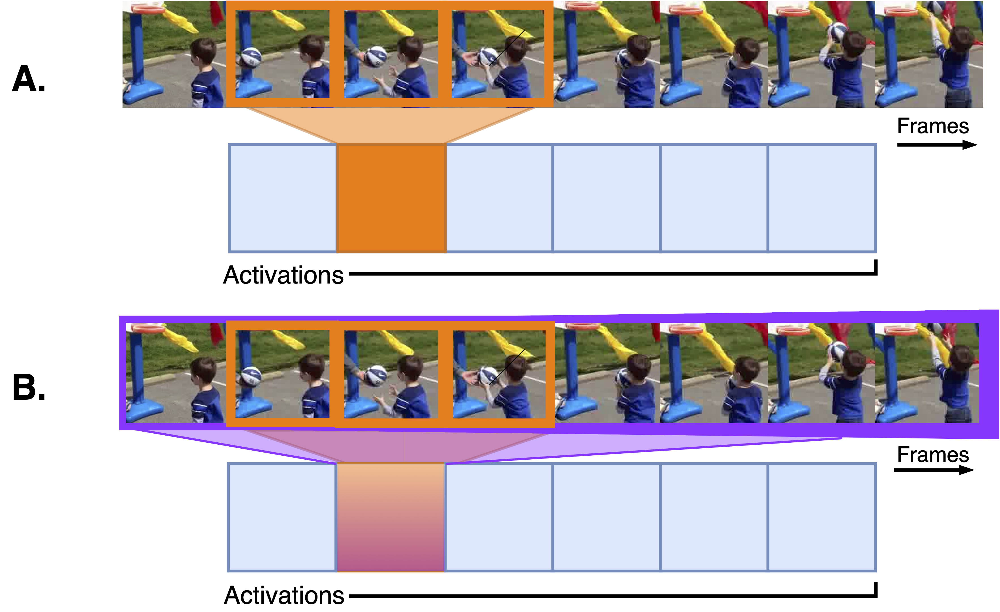
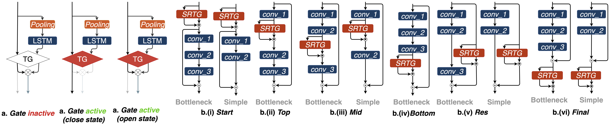

# Video Action Recognition pytorch
### Code implementation for:
- Learn to cycle: Time-consistent feature discovery for action recognition [[pdf]](https://arxiv.org/abs/2006.08247)
- Right on Time: Multi-Temporal Convolutions for Human Action Recognition in Videos [[pdf]](https://arxiv.org/abs/2011.03949)

-brightgreen/?style=flat&logo=python&color=green)


--------------------------------------------------------------------------------

# Learn to cycle: Time-consistent feature discovery for action recognition
## Abstract
Generalising over temporal variations is a prerequisite for effective action recognition in videos. Despite significant advances in deep neural networks, it remains a challenge to focus on short-term discriminative motions in relation to the overall performance of an action. We address this challenge by allowing some flexibility in discovering relevant spatio-temporal features. We introduce Squeeze and Recursion Temporal Gates (SRTG), an approach that favours inputs with similar activations with potential temporal variations. We implement this idea with a novel CNN block that uses an LSTM to encapsulate feature dynamics, in conjunction with a temporal gate that is responsible for evaluating the consistency of the discovered dynamics and the modeled features. We show consistent improvement when using SRTG blocks, with only a minimal increase in the number of GFLOPs. On Kinetics-700, we perform on par with current state-of-the-art models, and outperform these on HACS, Moments in Time, UCF-101 and HMDB-51 <p align="center">
<i></i>
<br>
<a href="https://doi.org/10.1016/j.patrec.2020.11.012" target="blank">[Pattern Recognition Letters]</a>


<p align="center">


</p>

--------------------------------------------------------------------------------

# Right on Time: Multi-Temporal Convolutions for Human Action Recognition in Videos
## Abstract
The variations in the temporal performance of human actions observed in videos present challenges for their extraction using fixed-sized convolution kernels in CNNs. We present an approach that is more flexible in terms of processing the input at multiple timescales. We introduce Multi-Temporal networks that model spatio-temporal patterns of different temporal durations at each layer. To this end, they employ novel 3D convolution (MTConv) blocks that consist of a short stream for local space-time features and a long stream for features spanning across longer times. By aligning features of each stream with respect to the global motion patterns using recurrent cells, we can discover temporally coherent spatio-temporal features with varying durations. We further introduce sub-streams within each of the block pathways to reduce the computation requirements.
The proposed MTNet architectures outperform state-of-the-art 3D-CNNs on five action recognition benchmark datasets. Notably, we achieve at 87.22% top-1 accuracy on HACS, and 58.39% top-1 at Kinectics-700. We further demonstrate the favorable computational requirements. Using sub-streams, we can further achieve a drastic reduction in parameters (\~60%) and GLOPs (\~74%). Experiments using transfer learning finally verify the generalization capabilities of the multi-temporal features
<p align="center">
<i></i>
<br>
<a href="https://arxiv.org/pdf/2011.03949.pdf" target="bÂlank">[arXiv preprint]</a>


<p align="center">


--------------------------------------------------------------------------------

## Dependencies

Ensure that the following packages are installed in your machine:

+ `apex`  (version >= 0.1)
+ `coloredlogs`  (version >= 14.0)
+ `ffmpeg-python`  (version >=0.2.0)
+ `imgaug`  (version >= 0.4.0)
+ `opencv-python`  (version >= 4.2.0.32)
+ `torch` (version >= 1.4.0)
+ `youtube-dl` (version >= 2020.3.24)

You can install all of the packages with the following command:
```
$ pip install coloredlogs ffmpeg-python imgaug opencv-python torch torchvision youtube-dl
```

`Apex` can be downloaded based on the official [[github repo]](https://github.com/NVIDIA/apex)

> For calculating FLOPs/GMACs yourself it's suggested to use Vladislav Sovrasov's repo [[link]](https://github.com/sovrasov/flops-counter.pytorch)

> You can also calculate the forward/backward pass latency with the following simple code snippet:

```python
import time
  tmp = torch.rand(1,3,16,224,224).cuda()
  #--- INFERENCE TIME TEST ---
  net = srtg_r3d_101(num_classes=400).cuda()

  tot_forwrd_inf = 0
  tot_backward_inf = 0
  count = 0

  for epoch in range(0, 1000):

      # Forward inference
      torch.cuda.synchronize()
      since = int(round(time.time()*1000))
      output = net(tmp)
      torch.cuda.synchronize()
      time_elapsed = int(round(time.time()*1000)) - since

      loss = torch.mean(output)

      # Backward inference
      torch.cuda.synchronize()
      tsince = int(round(time.time()*1000))
      loss.backward()
      torch.cuda.synchronize()
      ttime_elapsed = int(round(time.time()*1000)) - tsince

      tot_forwrd_inf += time_elapsed
      tot_backward_inf += ttime_elapsed
      count +=1


  print ('Forward  inference time elapsed {}ms'.format(tot_forwrd_inf/count))
  print ('Backward inference time elapsed {}ms'.format(tot_backward_inf/count))
```

> ***! Disclaimer:*** This repository is heavily structurally influenced on Yunpeng Chen's MFNet repo [[link]](https://github.com/cypw/PyTorch-MFNet)

## Installation

Please also make sure that `git` is installed in your machine:

```
$ sudo apt-get update
$ sudo apt-get install git
$ git clone https://github.com/alexandrosstergiou/Squeeze-and-Recursion-Temporal-Gates.git
```

## Datasets

A custom format is used for all label files for each of the datasets. If using (1) your own data or (2) converting a file please ensure that the data are saved to `.csv` files with the following format:

|`label`|`youtube_id`/`id`|`time_start`(optional)|`time_end`(optional)|`split`|
|-----|------|-----|-----|----|

##### You can also download the already converted `.csv` label files for the Kinetics (Mini/200, 400, 600, 700), MiT, HACS, UCF101, HMDB51 \& Diving48 from [[this link]](https://drive.google.com/open?id=1ySOhq2Im6Ac19EaNwiMX0azzdC-xfkgh)


We include training/data loading scripts for six action/video recognition datasets:

- **Human Action Clips and Segments (HACS)** [[link]](http://hacs.csail.mit.edu/) : It includes a total of \~500K clip segments sampled over 50K videos. you can download the dataset  from [this link](http://hacs.csail.mit.edu/dataset/HACS_v1.1.1.zip), or alternatively visit the [project's website](http://hacs.csail.mit.edu/).
- **Kinetics** [[link]](https://deepmind.com/research/open-source/kinetics): Composed of approximately 600K clips over 700 classes (with previously 400 \& 600) and each clip having an average duration of 10 seconds. You can download all three sets from [this link](https://storage.googleapis.com/deepmind-media/Datasets/kinetics700.tar.gz).
- **Moments in Time (MiT)** [[link]](http://moments.csail.mit.edu/): Is composed of about 800K videos over 339 classes. Video durations are limited to 3 seconds. The labels can be downloaded from [the website](http://moments.csail.mit.edu/) after competing the form.
- **UCF-101** [[link]](https://www.crcv.ucf.edu/data/UCF101.php): A dataset of 13320 clips of 2~14 seconds. It includes a total of 101 action classes. The dataset can be downloaded in full from their website.
- **HMDB-51** [[link]](https://serre-lab.clps.brown.edu/resource/hmdb-a-large-human-motion-database/): The dataset includes a bit less than 10K video of 51 categories sampled from movies and series. The dataset can be downloaded directly from their website.
- **Diving-48** [[link]](http://www.svcl.ucsd.edu/projects/resound/dataset.html): Composed of a total 18K videos of diving actions. The dataset can be downloaded from the project's website.

All three HACS, Kinetics and MiT datasets can be dowloaded through the [ActivityNet's official Crawler](https://github.com/activitynet/ActivityNet/tree/master/Crawler/Kinetics) by changing the download script. Direct downloads are not (officially) supported due to the vastness of these datasets.

#### Conversion to SQLite3 for speed optimisation

Instead of extracting video frames to images we opt to use SQL databases for each of the videos. This effectively (1) limits the number of random read operations and (2) The number of _inodes_ used as individual image files (`.png`/`.jpeg`/etc.) increase the number of _inodes_ used significantly.

 **In total, the speed-up in reading times is close to ~1000x of that with conventional random-access image files**

*Table for loading speed comparisons between JPG images and SQL databases. Rates are denoted as clips/videos loaded per second (clips/sec.)*

| Batch size | 1536, 4, 80, 80 |384, 8, 112, 112 | 96, 16, 158, 158 |  48, 16, 224, 224 |
| ---------- | --- | --- | --- | --- |
| JPG | 4.06e+3 | 3.56e+2| 4.21e+1| 2.94e+1|
| SQL | **1.05e+6** | **8.07e+5**| **8.53e+4**| **4.69e+4**|


All of the experiments were done with an AMD Threadripper 2950X (128GB of RAM w/ 2666MHz) over 24 workers. Disks used: 2x Samsung 970 Evo Plus (2TB \& 1TB).

*You can use the `dataset2databse` pypi [package](https://pypi.org/project/dataset2database/) or [repo](https://github.com/alexandrosstergiou/dataset2database) to convert videos to SQL*:
```
$ pip install dataset2database
```

#### Directory formatting

We assume a fixed directory formatting for both the data and the labels used. The dataset should be of the following structure at a directory:

```
<dataset>
  |
  └─── jpg
        │
        └──<class_i>
        │     │
        │     │─── <video_id_j>
        │     │         │
        │     │         │─── frames.db
        │     │         └─── n_frames
        │     │    
        │     │─── <video_id_j+1>
        │     │         │
        │     │         │─── frames.db
       ...   ...        └─── n_frames
```

In the structure, any items enclosed in angle brackets should be changed to the correct dataset name, class names and video ids. The three standard elements that should remain the same across any dataset are:
- **jpg**: The the container folder for all the classes in the dataset.

- **frames.db**: The SQL database specific containing all the video frames in the format of `ObjId`: which should be a string containing the video filepath alongside the frame number and `frames` that encapsulate all the data. The SQL table should also be called `Images`.

- **n_frames**: A file that should only include the number of frames for the video for quick access.

> You can also use your own dataset if you follow the above structure and convert all your videos to SQL databases. The process for doing so should be identical for any of the currently supported datasets.

#### Data loading

The main data loading takes place in `data/video_iterator.py` which you can see for more information. Lines 87~110 handle both connecting to the sql databases and loading. A densely commented version of those lines can be found below for more info:

```python
con = sqlite3.connect('my_video_database.db')# Establishing connection
cur = con.cursor()# Cursor creation
frame_names = ["{}/{}".format(my_path.split('/')[-1],'frame_%05d'%(index+1)) for index in frame_indices]# Frame indices selection
sql = "SELECT Objid, frames FROM Images WHERE ObjId IN ({seq})".format(seq=','.join(['?']*len(frame_names)))# Build SQL request
row = cur.execute(sql,frame_names)# Execute SQL and retrieve frames
ids = []
frames = []
i = 0
row = row.fetchall()# Data fetching
# Video order re-arrangement
for ObjId, item in row:
  #--- Decode blob
  nparr  = np.fromstring(item, np.uint8)
  img = cv2.imdecode(nparr, cv2.IMREAD_COLOR)
  ids.append(ObjId)
  frames.append(img)
  i+=1
# Ensuring correct order of frames
frames = [frame for _, frame in sorted(zip(ids,frames), key=lambda pair: pair[0])]
# (if required) array conversion [frames x height x width x channels]
frames = np.asarray(frames)
```

#### Augmentations

To increase generalisation capabilities of the models we further include video augmentations inside our training process. These augmentations are primarily divided to **temporal-based** augmentations and **spatial-based** augmentations.

+ Temporal-based augmentations are used to perform changes at the temporal extend of the videos. Therefore, any variations based on time include:

  - Temporal sampling interval, which is the maximum number of skipped frames between two frames from which the final video will be composed by.
  - Frame sampling, which can either be done sequentially (e.g. centre-most frames) or randomly through a uniform/normal distribution.


+ Spatial-based augmentations are performed in frame-level and primarily change either the width-height or the channels/RGB values. We set a probability of 0.8 for performing **any** augmentations for each video, while each augmentation type is assigned a 0.4 probability. We make use of the `imgaug` package for all of our spatial augmentations:

    - Gaussian blur with a sigma { 0.1 , 0.2, 0.3}.
    - Per-channel addition in range of {-5, ..., 15}.
    - Gaussian noise with a scale of 76.5 (i.e 0.3 * 255).
    - Colour enhancement with a factor of (1.2, 1.6).
    - Motion blur with a kernel of { 3, 5, 7}.
    - Hue saturation addition {-16, ..., 16}.
    - Linear contrast with an alpha of {0.85, ..., 1.115}.
    - Perspective transform with scale {0.02,0.05}.
    - Rotation between {-10, ..., 10} degrees.

  Ranges and values were empirically evaluated in order to balance between a reasonable amount of deformation without alleviating the informative features of the video. It's important to note the **all video frames should present exactly the same type of spatial augmentations** to ensure coherence.  


#### Long-Short Cycles

We additionally use a Multigrid training schedule for both improving generalisation and training times. Our implementation is based on the [Wu *et al.* paper](https://arxiv.org/abs/1912.00998). For convenience three `Dataloader` objects are used for every long cycle that correspond to changes in data for each short cycle.
- In case of RAM constraints we suggest to either not use the Multigrid training implementation or decrease the number of workers at `train/model.py`.
- Ensure that you have at least 86GB of shared memory in your system.

## Usage

Training for each of the datasets is done through the homonym scripts.

#### Examples

**Training from scratch:** Training from scratch can be done by calling the script for corresponding dataset. The two call argument that you **should** include are the `dataset` for the directory of the dataset and `network` for the architecture to train.
```
python train_hacs.py --network srtg_r3d_34 --dataset /media/usr/m2ssd_vol1/data/HACS_videos/ --clip-size 324 --gpus 4 --lr-base 0.1 --batch-size 48
```

**Resuming training:** You can also resume training by loading previous states and specifying the epoch from which to continue after. You can specify the directory of the model to load weights from with `pretrained_3d`. You can load models from different disks with the absolute path. Secondly, you should specify the epoch from which to resume training from with `resume-epoch`.
```
python train_hacs.py --network srtg_r3d_50 --dataset /media/usr/m2ssd_vol1/data/HACS_videos/ --clip-size 256 --gpus 4 --pretrained_3d results/HACS/srtg_r3d_50_gates_False/srtg_r3d_50_ep-0020.pth --resume-epoch 21 --lr-base 0.1 --batch-size 32
```

**Weight initialisation/Transfer learning:** It is possible to initialise weights or use pre-trained networks. Similarly to resuming training if the network architecture includes some variations (e.g. the number of class neurones), only the corresponding weights will be loaded. For transfer learning, you can additionally use the `fine-tune` call argument to decrease the learning rate used for convolution weights while maintaining the same base learning rate for the added layers.
```
python train_kinetics.py --network srtg_r3d_34 --dataset /media/usr/m2ssd_vol1/data/Kinetics_videos/ --variant 700 --clip-size 224 --gpus 4 --pretrained_3d results/HACS/srtg_r3d_34_gates_False/srtg_r3d_34_ep-0080.pth --fine-tune True --lr-base 0.1 --batch-size 48
```

#### Calling arguments

The following arguments are used and can be included at the parser of any training script.

|Argument name | functionality|
| :--------------: | ------- |
| `debug-mode` | Boolean for additional logging while debugging. Especially useful for cases that custom implementations or data are used. |
| `dataset` | String for the full path of the dataset. It is suggested to use the explicit directory that the dataset is stored under. Could also be used to load a dataset in a different disk/location. |
| `clip-length` | Integer determining the number of frames to be used for each video. |
| `clip-size` | Integer for the spatial size (height \& width) of each frame.|
| `train-frame-inteval` | Integer for the frame sampling interval during training.|
| `val-frame-inteval` | Integer for the frame sampling interval during evaluation.|
| `task-name`| String for cases that multi-tasking in enabled (not currently fully implemented so left empty by default).|
| `model-dir` | String for the directory to save the models in `.pth` files as well as the accuracies during training and testing. |
| `log-file`| String for the logging file. If left empty as default, a standard named logging file is created.|
| `gpus` | Integer for the number of GPUs to be used. |
| `network`| String for the name of the model to be used.|
| `pretrained-3d`| Integer for the case that the weights are to be initialised from some previously trained model. As a non-strict weight loading implementation exists, networks that are trained on either different datasets (with different number of classes) or with additional/lesser layers can also be loaded. The weights that will be loaded are only the ones that both (1) share the same names and (2) have the same channel sizes.|
| `fine-tune`| Boolean for the case that the model is to be fine tuned. This essentially translated to the convolutional weights learning rate being smaller than that of the classifier's (FC) neurones. So the larger updates are done in the FC layer.|
| `resume-epoch`| Integer if the model is to be resumed from a specific epoch. Useful in cases where (1) The model training was interrupted, (2) Some quick parameter tests need to be made at a specific test, (3) To quickly check the learning rate schedule.|
| `batch-size`| Integer for the base size of the batch.|
| `long-cycles`| Boolean for enabling Long cycles |
| `short-cycles`| Boolean for enabling Short cycles |
| `lr-base`| Float for the initial learning rate. This is the learning rate based on which the cycle learning rate is changes and to which the decrease is applied at each scheduler step. |
| `lr-steps` | List for the epochs for which the learning rate will decrease/change. |
| `lr-factor` | Float or Int with which the learning rate changes. |
| `save-frequency`| Integer for when the model to be save in a `.pth` file.|
| `end-epoch`| Integer for the number of epoch.|
|`random-seed`| Integer number for seeding in any random operation (e.g. data shuffling)|

**Special call arguments**

The are some cases were additional arguments are used based on the structures or specific datasets:

|Argument name | script name |functionality|
| :--------------:| :----: | ------- |
|`variant`| `train_kinetics.py` | Integer for the Kinetics dataset type to be used (e.g. Mini-Kinetics with 200 classes or 400, 600, 700)|

#### Pre-trained weights
(note that models are trained with `float16`, `float32` stability has not been testes).
Table headers `network`, `clip-length`, `clip-size` and `batch-size` correspond to the script parameters used.

##### Models trained on HACS

Table headers (`network`, `clip-length`, `clip-size` and `batch-size`) correspond to passed arguments.

| `network`  | `clip-length` | `clip-size` | `batch-size`  | Top-1 | Top-5 |                         Checkpoints                          |
| :-----: | :--------: | :------: | :-----: | :-----: | :-----: | :----------------------------------------------------------: |
| `srtg_r3d_32` | 16 | 264 | 32 | 78.599 | 93.569 | [`[link]`](https://drive.google.com/file/d/151WUMcAsEIRxYNhipGhbczKKNB1AYA_2/view?usp=sharing) |
| `srtg_r3d_50` | 16 | 264 | 32 | 80.362 | 95.548 | [`[link]`](https://drive.google.com/file/d/17YUWmIy6MvrSv3JTsQLWIadxVgv9lGoc/view?usp=sharing) |
| `srtg_r3d_101` | 16 | 264 | 32 | 81.659 | 96.326 | [`[link]`](https://drive.google.com/file/d/1ZwfCcfdzkNUZtid-JvDZTd1mV8KkRJxN/view?usp=sharing) |
| `srtg_r2plus1d_50` | 16 | 264 | 32 | 83.774 | 96.560 | [`[link]`](https://drive.google.com/file/d/1CBL1bZ4_ayOvvqRFODOZC-CVjQ2LfM8H/view?usp=sharing) |
| `srtg_r2plus1d_101` | 16 | 264 | 32 | 84.326 | 96.852 | [`[link]`](https://drive.google.com/file/d/1CBL1bZ4_ayOvvqRFODOZC-CVjQ2LfM8H/view?usp=sharing) |
| `mtnet_xs` | 16 | 284 | 48 | 77.926 | 94.289 | [`[link]`](https://drive.google.com/file/d/1-EbE2dKmG61r8v467MJDWhC1d3nDPqAK/view?usp=sharing) |
| `mtnet_s` | 16 | 284 | 48 | 80.712 | 95.182 | [`[link]`](https://drive.google.com/file/d/1wGXuiJPrhKg8N0SeP82gSnOwbP1HW8cL/view?usp=sharing) |
| `mtnet_m` | 16 | 284 | 48 | 83.447 | 95.872 | [`[link]`](https://drive.google.com/file/d/160_xtXnBRaiz-1qG9Wxwh1JjUzpe5wq8/view?usp=sharing) |
| `mtnet_l` | 16 | 284 | 48 | 86.574 | 96.658 | [`[link]`](https://drive.google.com/file/d/1uRXNVjpMWkfUTWFX4s4bl35QThysb5ut/view?usp=sharing) |


#### Switching from half to single point precision

We are currently using NVIDIA's [`apex`](https://github.com/NVIDIA/apex) PyTorch extension for training our models with mixed precision. By default we use Automatic Mixed Precision (amp) for simplicity with `opt_level` of `01`. This patches most of the PyTorch functions casting their types from `float32` -> `float16`. Exceptions include both SoftMax and Normalisation methods that are kept in `float32` instead.

## Monitoring

#### Scores format

We report the loss, top-1 and top-5 accuracy during each logging interval during training. For validation, we report the average loss updated after each batch. Both top-1 and top-5 accuracies are saved in a `.csv` file for both train and validation.

#### Speed monitoring

We also provide a monitor for speeds in terms of video-reading from disk (CPU), forward pass (GPU) and backprop (GPU). Speeds are reported as clips per second. You can have a look at class `SpeedMonitor` in `train/callbacks.py` for more information. Overall the output at each logging interval should look like:

<center>
... Speed (r=<span style="color:#a1e2b7">1.53e+5</span> f=<span style="color:#f3e27a">9.84e+1</span> b=<span style="color:#ff7d75">1.78e+1</span>) ...
</center>


Colours are used in order to give a quick understanding if the speed is in general <span style="color:#a1e2b7">fast</span>, <span style="color:#f3e27a">average</span> or <span style="color:#ff7d75">slow</span>. The limits for each of the speeds are defined as:

- reading (r)  <span style="color:#ff7d75">(red) 100</span> < <span style="color:#f3e27a">(yellow) 3000</span> < <span style="color:#a1e2b7">(green) inf</span>

- forward (f)  <span style="color:#ff7d75">(red) 50</span> < <span style="color:#f3e27a">(yellow) 300</span> < <span style="color:#a1e2b7">(green) inf</span>

- backward (r)  <span style="color:#ff7d75">(red) 20</span> < <span style="color:#f3e27a">(yellow) 200</span> < <span style="color:#a1e2b7">(green) inf</span>

**Note that the biggest factor for speeds is the video/clip size rather than the video size**. Reading speeds will fall at average/slow speeds only during `Dataloader` initialisations.


#### Batch size \& lr monitoring

Along scores, speed the batch size and learning rate are also monitored at each logging interval. This is especially useful for using cycles.

## Hardware specifications

All experiments were run with 4x NVIDA 2080 Ti GPUs with a shared memory of 128GB. If you are in Ubuntu the easiest way to assign a larger amount of shared memory is to use:

```
$ df -h
```
To find the size of `/dev/shm` . And then edit/insert the line below in `/etc/fstab`:

`none /dev/shm tmpfs defaults,size=86G 0 0`
Then exit and run (w/ `sudo`):
```
--- If line was now added: ---
$ mount /dev/shm

--- If line was edited: ---
$ mount -o remount /dev/shm
```


## Citation
```
@article{stergiou2021improved,
  title={Learn to cycle: Time-consistent feature discovery for action recognition},
  author={Stergiou, Alexandros and Poppe, Ronald},
  journal = {Pattern Recognition Letters},
  volume = {141},
  pages = {1--7},
  year = {2021},
  issn = {0167-8655},
  doi = {https://doi.org/10.1016/j.patrec.2020.11.012}
}

@article{stergiou2020right,
  title={Right on Time: Multi-Temporal Convolutions for Human Action Recognition in Videos},
  author={Alexandros Stergiou and Ronald Poppe},
  journal={arXiv preprint arXiv:2011.03949},
  year={2020}
}
```

## Licence

MIT

## Contact

Alexandros Stergiou

a dot g dot stergiou at uu dot nl (a.g.stergiou@uu.nl)

Any queries or suggestions are much appreciated!
